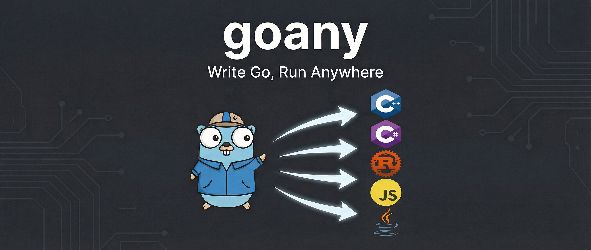

# goany



Copyright (c) 2024-2026 Przemyslaw Delewski

A Go language transpiler that generates portable code for multiple target platforms. Write your code once in Go and transpile it to C++, C#, Rust, JavaScript, or Java.

[**▶ Try the C64 Emulator Demo WIP (runs in browser)**](https://pdelewski.github.io/goany/docs/demos/c64.html)

[**▶ Immediate-Mode GUI Demo**](https://pdelewski.github.io/goany/docs/demos/gui.html)

[**▶ MOS 6502 Text Sprites Demo**](https://pdelewski.github.io/goany/docs/demos/text.html) | [**▶ MOS 6502 Basic Graphics Shapes Demo**](https://pdelewski.github.io/goany/docs/demos/graphic.html) | [**▶ MOS 6502 Text Scroll Demo**](https://pdelewski.github.io/goany/docs/demos/textscroll.html)

## Overview

This project provides a foundation for writing portable libraries in Go that can be transpiled to multiple backend languages. Currently supported backends:

- **C++** - generates `.cpp` files
- **C#** (.NET) - generates `.cs` files
- **Rust** - generates `.rs` files
- **JavaScript** - generates `.js` files (runs in browser with Canvas API)
- **Java** - generates `.java` files

## Project Goals

The main aim of goany is to provide a tool for writing **portable applications and libraries** that work across different programming languages and platforms.

### Key Objectives

1. **Cross-language portability** - Write code once and transpile it to C++, Rust, C#/.NET, JavaScript, and Java, enabling code reuse across different ecosystems and platforms.

2. **Near 1-to-1 translation** - The generated code maintains almost direct correspondence to the original source, making it readable, debuggable, and easy to understand.

3. **Focused feature set** - goany intentionally does not support all Go language features. The goal is to support the subset needed to write reusable libraries across languages, not to be a complete Go transpiler.

### Important Note

> **All valid goany programs are valid Go programs, but not vice-versa.**

This means:
- You can compile and run any goany program with the standard Go toolchain
- Not every Go program can be transpiled by goany (only the supported subset)
- goany source files are regular `.go` files that follow Go syntax

This design allows you to develop and test your code using Go's excellent tooling, then transpile to other languages when ready for deployment.

## Building

### Prerequisites

| Requirement | Purpose | Installation |
|-------------|---------|--------------|
| **Go 1.24+** | Compiler core | [go.dev/dl](https://go.dev/dl/) |
| **g++** | astyle library (CGO) | See platform instructions below |
| **.NET 9 SDK** | C# backend tests | [dotnet.microsoft.com](https://dotnet.microsoft.com/download/dotnet/9.0) (optional) |
| **Rust** | Rust backend tests | [rustup.rs](https://rustup.rs/) (optional) |
| **Node.js** | JavaScript backend tests | [nodejs.org](https://nodejs.org/) (optional) |
| **Java 21+** | Java backend tests | [adoptium.net](https://adoptium.net/) (optional) |
| **SDL2** | Graphics with `-graphics-runtime=sdl2` | See below (optional) |

### Linux / macOS

```bash
cd cmd
make
```

This builds the astyle library and goany in one step.

On macOS, install Xcode command line tools if needed:
```bash
xcode-select --install
```

On Linux (Debian/Ubuntu):
```bash
sudo apt install build-essential
```

For SDL2 graphics (optional):
```bash
# macOS
brew install sdl2

# Linux (Debian/Ubuntu)
sudo apt install libsdl2-dev
```

### Windows

**Step 1: Install MinGW-w64**

Download from [github.com/niXman/mingw-builds-binaries/releases](https://github.com/niXman/mingw-builds-binaries/releases)

Recommended: `x86_64-*-release-posix-seh-ucrt-*.7z`

Extract to `C:\mingw64` and add `C:\mingw64\bin` to your PATH.

Verify:
```cmd
g++ --version
```

For SDL2 graphics (optional), download development libraries from [libsdl.org](https://github.com/libsdl-org/SDL/releases) and add to your include/lib paths.

**Step 2: Build**

Use the build script:
```cmd
build.bat
```

Or manually:
```cmd
cd compiler\astyle
g++ -c -Wall -O2 -DASTYLE_LIB -std=c++17 ASBeautifier.cpp -o ASBeautifier.o
g++ -c -Wall -O2 -DASTYLE_LIB -std=c++17 ASEnhancer.cpp -o ASEnhancer.o
g++ -c -Wall -O2 -DASTYLE_LIB -std=c++17 ASFormatter.cpp -o ASFormatter.o
g++ -c -Wall -O2 -DASTYLE_LIB -std=c++17 ASResource.cpp -o ASResource.o
g++ -c -Wall -O2 -DASTYLE_LIB -std=c++17 astyle_main.cpp -o astyle_main.o
ar rcs libastyle.a ASBeautifier.o ASEnhancer.o ASFormatter.o ASResource.o astyle_main.o
cd ..\..

cd cmd
set CGO_ENABLED=1
set CC=gcc
set CXX=g++
go build -o goany.exe .
```

### Docker

Build and run in a container with all dependencies:

```bash
# Build the image
docker build -t goany .

# Run tests
docker run --rm goany bash -c "cd cmd && go test -v ./..."

# Interactive shell
docker run --rm -it goany bash

# Transpile a project (mount local directory)
docker run --rm -v $(pwd)/myproject:/work goany goany -source=/work -output=output
```

A simpler Dockerfile is also available:
```bash
docker build -f Dockerfile.simple -t goany .
```

### Make Targets

For development, you can also use the Makefile in `cmd/`:

```bash
cd cmd
make
```

| Target | Description |
|--------|-------------|
| `make` | Build the project (default) |
| `make build` | Generate code, build astyle, and build goany binary |
| `make clean` | Clean all build artifacts |
| `make rebuild` | Clean and rebuild everything |
| `make dev` | Development build (with debug info) |
| `make prod` | Production build (optimized) |
| `make test` | Run tests |
| `make help` | Show all available targets |

## Usage

```bash
./goany -source=[directory] -output=[name] -backend=[backend]
```

### Flags

| Flag | Description | Default |
|------|-------------|---------|
| `-source` | Source directory containing Go files | (required) |
| `-output` | Output file name (without extension) | (required for transpilation) |
| `-backend` | Backend(s) to use: `all`, `cpp`, `cs`, `rust`, `js`, `java` | `all` |
| `-link-runtime` | Path to runtime for linking (generates build files with include paths) | (none) |
| `-graphics-runtime` | Graphics backend: `tigr`, `sdl2`, `none` | `tigr` |
| `-check-sema` | Check syntax and semantics only, no transpilation | `false` |
| `-debug` | Enable debug output | `false` |

The `-backend` flag accepts comma-separated values for multiple backends.

The `-graphics-runtime` flag selects the graphics library:
- `tigr` - Bundled, header-only library (C++ only, no external dependencies)
- `sdl2` - SDL2 library (requires SDL2 installed, supports all backends)
- `none` - No graphics support (for CLI applications)

### Examples

Transpile to all backends:
```bash
./goany -source=../examples/uql -output=uql
```

Transpile to Rust only:
```bash
./goany -source=../examples/uql -output=uql -backend=rust
```

Transpile to C# and Rust:
```bash
./goany -source=../examples/uql -output=uql -backend=cs,rust
```

Transpile to Java:
```bash
./goany -source=../examples/uql -output=uql -backend=java
```

Transpile to JavaScript (runs in browser):
```bash
./goany -source=../examples/mos6502/cmd/c64 -output=c64 -backend=js -link-runtime=../runtime
```

Transpile graphics demo with tigr (default):
```bash
./goany -source=../examples/graphics-demo -output=./build/graphics-demo -backend=cpp -link-runtime=../runtime
```

Transpile graphics demo with SDL2 (all backends):
```bash
./goany -source=../examples/graphics-demo -output=./build/graphics-demo -backend=rust -link-runtime=../runtime -graphics-runtime=sdl2
```

Transpile CLI app without graphics:
```bash
./goany -source=../examples/uql -output=./build/uql -link-runtime=../runtime -graphics-runtime=none
```

Check syntax and semantics only (no transpilation):
```bash
./goany -source=../examples/uql -check-sema
```

## Supported Features

goany supports a subset of Go designed for cross-platform portability:

- **Types**: primitives (`int8`-`int64`, `uint8`-`uint64`, `float32`, `float64`, `bool`, `string`), slices, structs, function types
- **Constructs**: variables, functions (multiple returns), methods, for loops, if/else, switch
- **Graphics**: cross-platform 2D graphics library with tigr, SDL2, and Canvas backends

See [docs/supported-features.md](docs/supported-features.md) for detailed documentation, limitations, and known issues.

## Project Structure

| Directory | Description |
|-----------|-------------|
| `cmd/` | CLI entry point (`main.go`, `Makefile`) |
| `compiler/` | Backend emitters (`cpp_emitter.go`, `csharp_emitter.go`, `rust_emitter.go`, `js_emitter.go`, `java_emitter.go`) |
| `runtime/` | Runtime libraries (graphics for Canvas/SDL2/TIGR) |
| `examples/` | Example projects (`uql`, `contlib`, `graphics-demo`, `mos6502`) |
| `scripts/` | Utility scripts (`setup-deps.sh`) |
| `tests/` | Test cases |

## License

This project is licensed under the Apache License, Version 2.0. See [LICENSE](LICENSE) for details.
