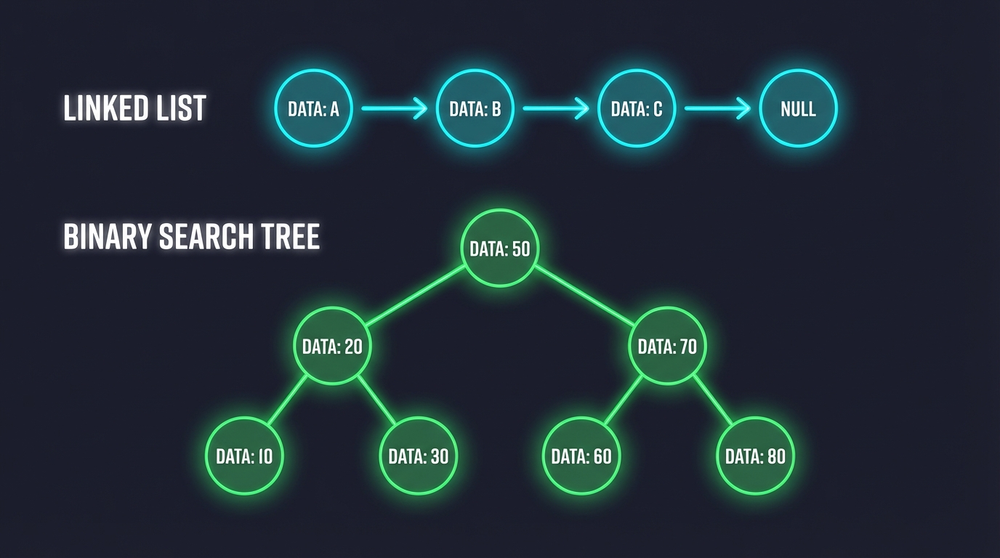

# Container Library Example



A demonstration of data structure implementations in goany (Go subset that transpiles to C++/C#/Rust).

## Features

This example implements two classic data structures:

### Linked List
- `NewList()` - Create a new empty linked list
- `Add(list, value)` - Add an element to the list
- `Remove(list, value)` - Remove an element from the list
- `PrintList(list)` - Print all elements in the list

### Binary Search Tree
- `NewBinaryTree()` - Create a new empty binary tree
- `Insert(tree, value)` - Insert a value into the tree
- `RemoveFromTree(tree, value)` - Remove a value from the tree
- `PrintTree(tree)` - Print tree elements (in-order traversal)

## Building

```bash
# From the cmd directory
./goany --source=../examples/contlib --output=build/contlib --link-runtime=../runtime

# Compile C++
cd build/contlib && make

# Or compile C#
cd build/contlib && dotnet build

# Or compile Rust
cd build/contlib && cargo build
```

## Running

```bash
# C++
./contlib

# C#
dotnet run

# Rust
cargo run
```

## Expected Output

```
List after adding elements:
10 -> 20 -> 30 -> 40 -> nil
List after removing 20:
10 -> 30 -> 40 -> nil
List after removing 10:
30 -> 40 -> nil
Binary tree after inserting elements:
10 20 30 40 50
Binary tree after removing 30:
10 20 50 40
Binary tree after removing 10:
40 20 50
```

## Structure

```
contlib/
├── main.go           # Main program demonstrating usage
├── go.mod            # Go module file
└── containers/       # Container implementations
    └── containers.go # List and BinaryTree types
```
