<!-- _class: title -->

# Transpiling Go To Rust and Others

### GoAny: Go-to-Multilanguage Transpiler

**Przemyslaw Delewski**
April 2025

---

<!-- Section 1: About Me -->

# About Me

- **Founding engineer at Quesma** — working on Reinforcement Learning datasets
- **15 years in observability** — Dynatrace, Sumo Logic
  - Engineer, tech lead, team lead, architect
- **Navigation software** at TomTom
- **OpenTelemetry maintainer** — compile-time Go instrumentation
- **PHP emeritus maintainer**
- Passionate about programming languages

---

# Disclaimer

This is the first time I'm talking about GoAny publicly.

The flow might not be perfect.

---

# Agenda

1. **Background** — why transpile at all?
2. **GoAny's Approach** — using Go as the source language
3. **Core Primitives** — the minimal universal subset
4. **Compiler Architecture** — frontend passes and lowering
5. **Backend Challenges** — C++, Rust, C#, Java, JavaScript
6. **Optimizations** — clone elimination, memory layout, performance

---

<!-- _class: title -->

# Background

---

<!-- Section 2: Historical Context -->

# The Problem

**The same thing implemented multiple times in different languages.**

Every organization eventually faces this:
- Shared libraries needed across backend services in different languages
- Algorithmic code duplicated for each platform
- Bugs fixed in one language, forgotten in another

**Ideal:** write once, transpile deterministically to all targets.

---

# Existing Solutions

| Approach | Pros | Cons |
|---|---|---|
| **FFI** (write in C, expose API) | Mature, widely used | Complex binding layers, memory safety issues |
| **Haxe** | Independent language, many backends | Must learn new language, small ecosystem |
| **Fusionlang** | Designed for transpilation | Independent language, limited adoption |

All independent-language solutions share one problem:
**you must design and learn a new language.**

---

<!-- _class: title -->

# GoAny's Approach

---

<!-- Section 3: GoAny Base Principles -->

# A Different Approach

Instead of designing a new language, **GoAny uses Go**.

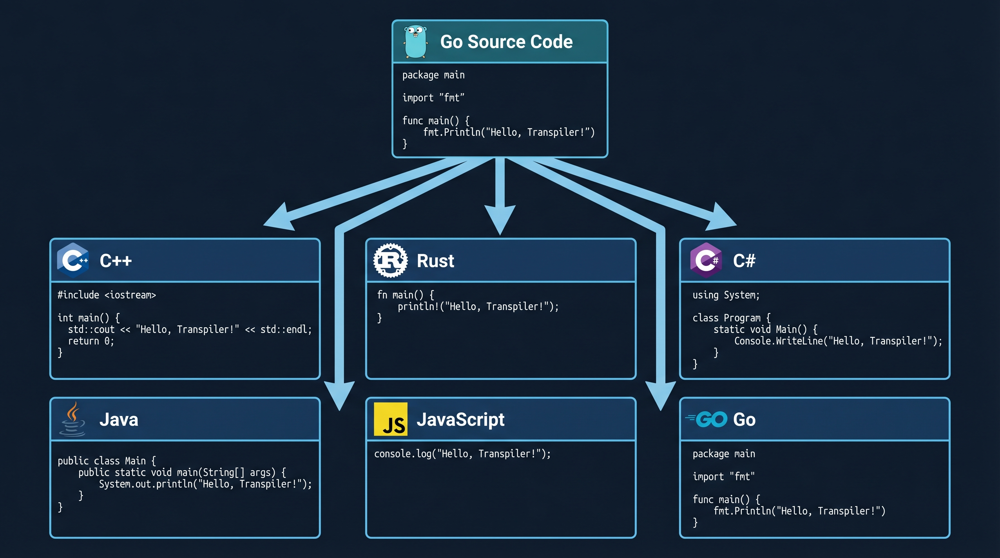

Go is a real language with a real ecosystem, tooling, and community.

---

<!-- Section 4: Key Challenges -->

# Key Challenges

### 1. What primitives to choose?

- Which language constructs form a universal subset?
- What can be mapped to every target language?

### 2. How to deal with different memory models?

- Go: garbage collected, value semantics
- Rust: ownership + borrow checker
- C++: manual memory, RAII
- Java/C#: garbage collected, reference semantics
- JavaScript: garbage collected, prototype-based

---

# Tradeoffs: Existing Language vs New Language

| | New Language | Existing Language (Go) |
|---|---|---|
| **Syntax freedom** | Total control | Constrained by Go spec |
| **Tooling** | Must build from scratch | IDE, debugger, linter for free |
| **Learning curve** | Users must learn it | Many already know Go |
| **Ecosystem** | None | Go standard library, packages |
| **Feature scope** | Design what you need | Must choose a subset |

GoAny's approach: **support a subset of Go** that maps cleanly to all backends.

---

# GoAny ⊂ Go

Every GoAny program is a **valid Go program** — but not vice versa.

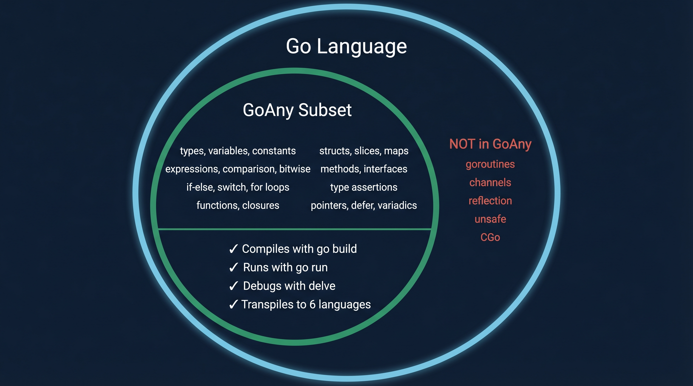

You develop and test in Go, then transpile.

---

<!-- _class: title -->

# Core Primitives

---

<!-- Section 5: Core Primitives -->

# What Primitives Are Needed?

<div class="columns">
<div>

- **Types** — `int`, `float64`, `bool`, `string`
- **Variables** — declaration, assignment, constants
- **Expressions** — arithmetic, logical,
  comparison, bitwise
- **Control flow** — `if`/`else`, `switch`, `for`
- **Functions** — declaration, call, return

These exist in **every** language.

</div>
<div>

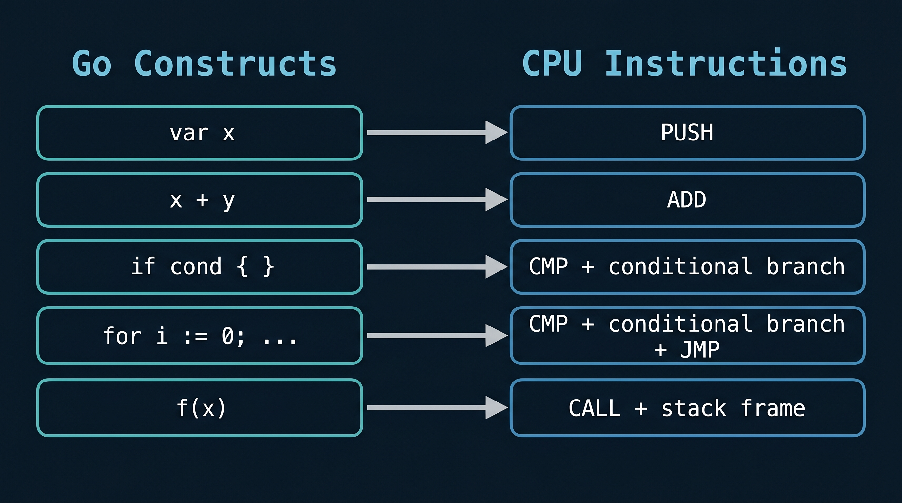

</div>
</div>

---

# The Key Decision: No explicit Pointers and References

**GoAny's initial subset does not support pointers.**

Only arrays (slices) as the universal data container:

| Language | Array Type |
|---|---|
| Go | `[]T` |
| C++ | `std::vector<T>` |
| Rust | `Vec<T>` |
| Java | `ArrayList<T>` |
| C# | `List<T>` |
| JavaScript | `Array` |

Arrays are the one primitive every language supports natively.

---

# Demo: What You Can Build with the Core Subset

### MOS 6502 CPU Emulator (`examples/mos6502`)
- Full instruction set emulation with 64KB memory — [C64 Demo](https://pdelewski.github.io/goany/docs/demos/c64.html)
- `./goany -source=../examples/mos6502/cmd/c64 -output=./build/c64 -backend=rust -link-runtime=../runtime -optimize-moves -optimize-refs`

<!-- Live demo here -->

---

# Runtime Packages: The Native Escape Hatch

Every language ships with a runtime library — native intrinsics that expose APIs to user code.
GoAny is no different: each backend gets its own native implementation.

<div class="columns">
<div>

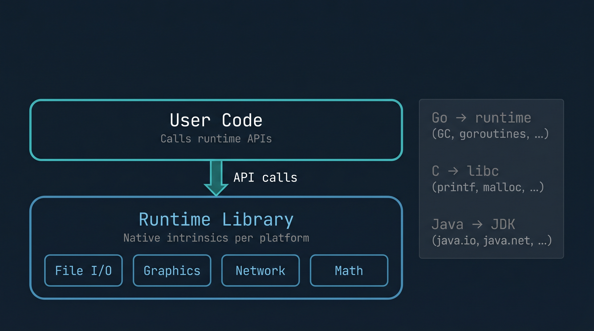

</div>
<div>

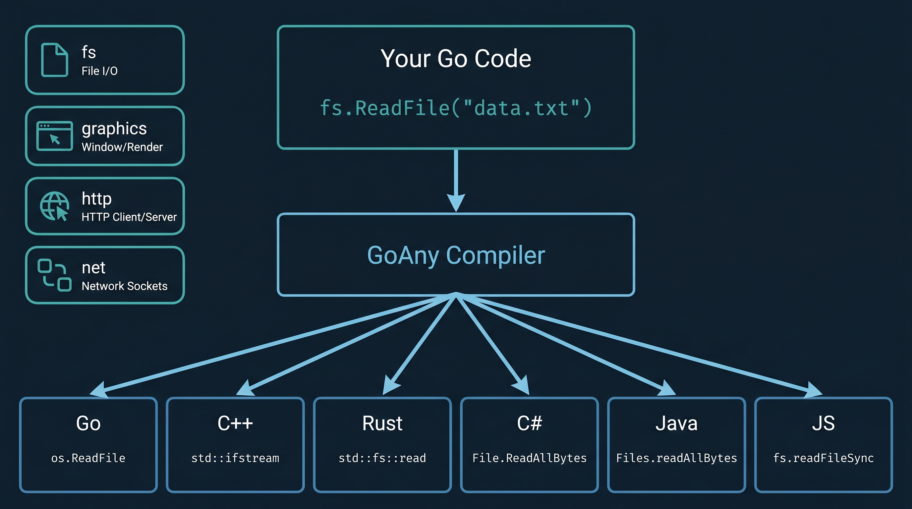

</div>
</div>

---

# How Runtime Linking Works

The compiler **auto-detects** `runtime/` imports and generates per-backend linking:

```go
// Your Go code:
import "runtime/fs"
content, err := fs.ReadFile("data.txt")
```

| Backend | What Gets Generated |
|---|---|
| Go | `go.mod` replace directive → local runtime package |
| C++ | Makefile with `-I/runtime`, `#include <fs/fs_runtime.hpp>` |
| Rust | `mod fs_runtime` with native Rust I/O |
| C# | `fs_runtime.cs` included in project |
| Java | `FsRuntime.java` class |

---

# Demo: Runtime in Action

### GUI Demo (`examples/gui-demo`)
- Interactive widgets: buttons, checkboxes, sliders, menus, tabs — [GUI Demo](https://pdelewski.github.io/goany/docs/demos/gui.html)
- `./goany -source=../examples/gui-demo -output=./build/gui-demo -backend=rust -link-runtime=../runtime -optimize-moves -optimize-refs`
- Imports `runtime/graphics` — native window rendering per backend
- Same Go code → C++ (TIGR), Rust (TIGR), JS (Canvas), ...

<!-- Live demo here -->

---

<!-- _class: title -->

# Compiler Architecture

---

<!-- Section 6: Evolution -->

# Evolution: Growing the Circle

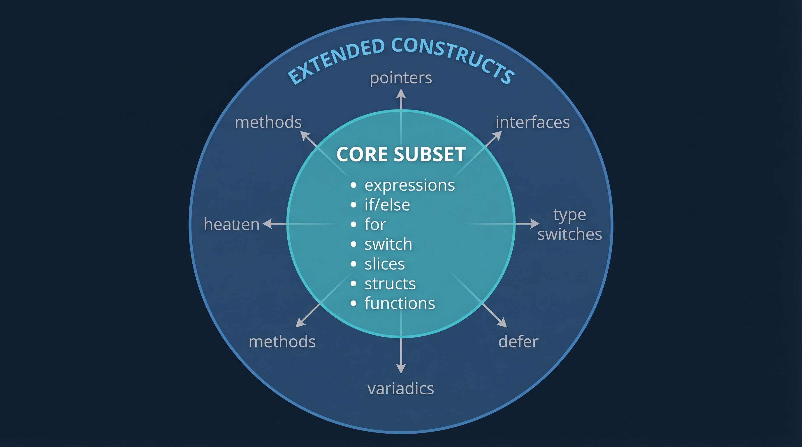

Each new construct is built on top of the core via **compiler passes**
that lower it to constructs already supported.

---

<!-- Section 7: Architecture -->

# GoAny Architecture

All passes operate on **Go AST/IR** — frontend passes are shared, backend
passes are language-specific.

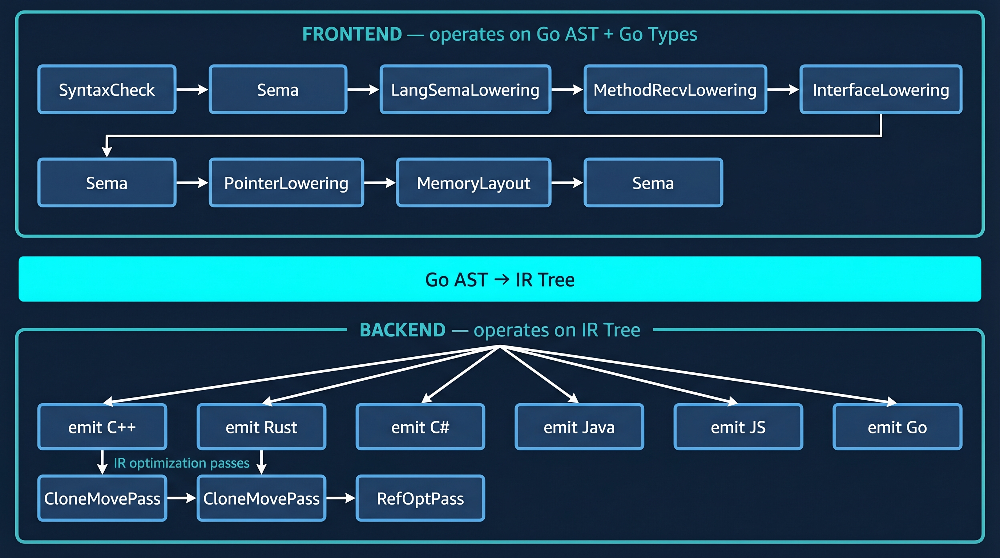

**Frontend**: lowers Go constructs (interfaces, pointers, methods) into simpler IR.
**Backend**: emits target code + IR optimization passes (C++/Rust only).

---

<!-- Section 8: Pass Descriptions -->

# LangSemaLowering: 12 Transforms

Rewrites Go patterns that lack direct equivalents in target backends:

| # | Transform | Example |
|---|---|---|
| 1 | Named Returns | `func f() (x int) { return }` → explicit return |
| 2 | Iota Expansion | `A = iota` → `A = 0`, `B = 1`, ... |
| 3 | Variadics | `f(args ...int)` → `f(args []int)` |
| 4 | Make Capacity | `make([]T, n, cap)` → `make([]T, n)` |
| 5 | Integer Range | `for i := range 10` → classic for loop |
| 6 | Type Switch | `switch v := x.(type)` → if/else chain |

---

# LangSemaLowering (continued)

| # | Transform | Condition |
|---|---|---|
| 7 | Tagless Switch | `switch { case x>0: }` → if/else |
| 8 | String Switch | `switch s { case "a": }` → if/else with `==` |
| 9 | Defer | `defer f()` → inline before returns (LIFO) |
| 10 | Multi-Assign | C++ only: `a, b := 1, 2` → split |
| 11 | Shadowed Vars | C# only: rename `x` → `x_2` |
| 12 | Field Conflicts | C++ only: `struct { Baz Baz }` → `BazVal Baz` |

Each transform lowers an unsupported pattern into constructs
that **all backends** can handle.

---

# MethodReceiverLowering

Transforms methods into free functions:

```go
// Before:
func (f File) Write(data []byte) int { ... }

// After:
func File_Write(f File, data []byte) int { ... }
```

**Why?** Not all backends support Go-style method receivers. Free functions
are universally supported.

Call sites are rewritten: `f.Write(data)` → `File_Write(f, data)`

---

# InterfaceLowering

Transforms interfaces into structs with function pointer fields:

```go
// Before:
type Writer interface {
    Write(data []byte) int
}

// After:
type Writer struct {
    _data     interface{}                    // type-erased value
    _hasValue bool                           // nil check flag
    _Write    func(interface{}, []byte) int  // method dispatch
}
```

Method calls become: `w.Write(buf)` → `w._Write(w._data, buf)`

Wrapper lambdas bridge type-erased `_data` to concrete `Type_Method` functions.

---

# PointerLowering

Transforms pointers into pool-based indexing:

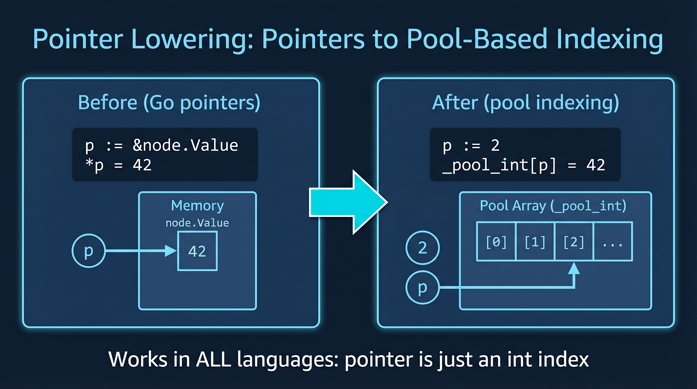

Pools are passed as extra function arguments and returned as extra return values.

---

# Pointer Lowering: Function Signatures


---

<!-- _class: title -->

# Backend Challenges

---

<!-- Section 9: Backend Challenges -->

# Backend Challenges: C# and Java

### C#
- **Variable shadowing** forbidden (CS0136)
  - `x := 1; if true { x := 2 }` — illegal in C#
  - LangSemaLowering renames: `x_2`
- **`in` keyword** for read-only reference parameters

### Java
- **Only signed integer types** — no `uint8`, `uint16`, etc.
- **Lambda variable binding** — captured variables must be effectively final
- **Lambda mutation** — can't mutate captured variables directly
- **Functional interfaces** — `BiFunction.apply()` for calling function fields

---

# Backend Challenges: C++ and Rust

### C++
- **No string switch** — `switch(std::string)` is illegal → lowered to if/else
- **Field name conflicts** — `struct { Baz Baz; }` → renamed to `BazVal`
- **Multi-assignment** — `a, b := 1, 2` has no direct equivalent

### Rust
- **Move semantics by default** — Go copies implicitly; Rust moves, so every reuse needs `.clone()`
- **Borrow checker** — `c = SetZN(c, c.A)` illegal — `c` moved on first arg, used on second
- **No implicit numeric conversions** — every `int(x)` needs explicit `as i32` cast

---

# Backend Challenges: JavaScript

- **No blank identifier** — `_` in destructuring becomes empty slot: `[, x]`
- **No integer types** — everything is `Number` (float64)
- **No struct types** — structs mapped to plain objects / classes

---

<!-- _class: title -->

# Optimizations

---

<!-- Section 10: Optimizations Overview -->

# Optimizations: Beyond Correctness

Transpilation produces **correct** code — but correct is not enough.
The same Go source hits different performance walls on each target:

| Target | Problem | Solution |
|---|---|---|
| **C++** | Value-copy semantics → quadratic deep copies | `std::move()` insertion (CloneMovePass) |
| **Rust** | Borrow checker rejects shared access | `.clone()` elimination + temp extraction |
| **All** | Cache misses from AoS layout | Automatic AoS → SoA (MemoryLayoutPass) |
| **C++/Rust** | Read-only params copied unnecessarily | `const T&` / `&T` references (RefOptPass) |

GoAny applies **IR-level passes** that optimize across all backends —
the same pass pipeline, different results per target.

---

<!-- Section 10 cont: Translation to Rust -->

# Translation to Rust: The Conservative Approach

Without optimizations, the Rust emitter adds `.clone()` everywhere:

```go
// Go source:
c = Step(c)
c = SetZN(c, c.A)
```

```rust
// Rust output (conservative):
c = Step(c.clone());
c = SetZN(c.clone(), c.A);
```

**Why?** Go passes structs by value (implicit copy). Rust moves by default.
Adding `.clone()` preserves Go's value semantics safely.

**Problem:** For a CPU struct with 64KB memory array, each `.clone()` is a
deep copy. A single frame generates **~300MB of unnecessary memcpy**.

---

<!-- Section 11: Optimizations -->

# Three-Stage Optimization Pipeline

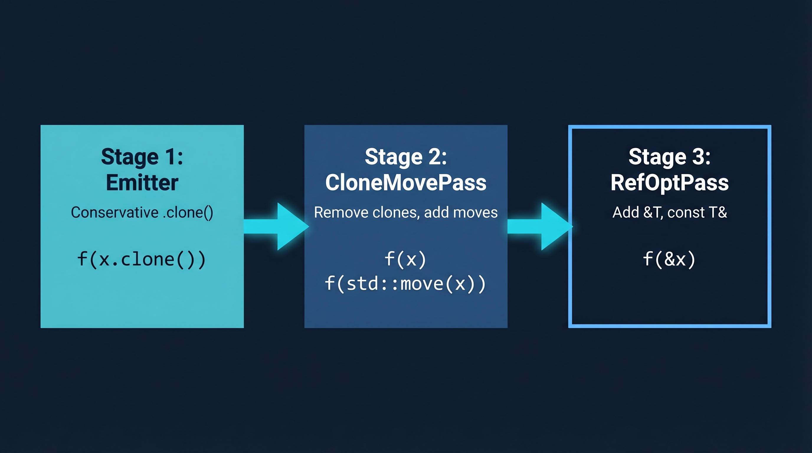

- **Emitter**: Adds `.clone()` conservatively, sets optimization flags
- **CloneMovePass**: Removes clones where ownership transfers, adds `std::move()`
- **RefOptPass**: Converts read-only params to references (`&T`, `const T&`)

All optimizations operate on the **IR tree**, not on emitted text.

---

# `--optimize-moves`: Move Detection

**Pattern:** `variable = Function(variable, ...)`

When a variable appears on both sides of an assignment, the old value is consumed.
This is semantically a **move**, not a copy.

```rust
// Before:
c = Step(c.clone());           // 64KB deep copy

// After (move detected):
c = Step(c);                   // zero-cost move
```

**Conditions for safe move:**
1. Variable appears on LHS of the assignment
2. Variable appears only once across all call arguments
3. Not inside a closure (`funcLitDepth == 0`)

---

# `--optimize-moves`: Temp Extraction

**Pattern:** `variable = Function(variable, variable.Field)`

When a variable appears multiple times (blocking move), extract field accesses:

```rust
// Before:
c = SetZN(c.clone(), c.A);          // clone required: c used twice

// After (field extracted to temp):
let __mv0: u8 = c.A;                // extract Copy-type field
c = SetZN(c, __mv0);                // now c appears once → move!
```

Also works for `std::mem::take` on struct fields:
```rust
// Before:
state.C = Run(state.C.clone());     // 64KB deep copy

// After:
state.C = Run(std::mem::take(&mut state.C));  // zero-cost swap
```

---

# `--optimize-refs`: Reference Optimization

Analyzes function bodies to find **read-only parameters** — parameters that
are never mutated, returned, or assigned from.

```rust
// Before:
fn CompileImmediate(mut state: BasicState, line: String) -> Vec<u8> { ... }
let code = CompileImmediate(state.clone(), line.clone());

// After:
fn CompileImmediate(state: &BasicState, line: String) -> Vec<u8> { ... }
let code = CompileImmediate(&state, line.clone());
```

| Language | Param Transform | Call-site Transform |
|---|---|---|
| Rust | `mut name: T` → `name: &T` | `.clone()` → `&` |
| C++ | `Type name` → `const Type& name` | (unchanged) |
| C# | `Type name` → `in Type name` | `x` → `in x` |

---

# Optimization Impact: Clone Reduction

Results on the C64 emulator codebase (MOS 6502 CPU with 64KB memory):

| Optimization | Clones Removed |
|---|---|
| Move detection (reassigned variables) | -192 |
| Temp extraction (field accesses) | -44 |
| Type conversion support | -17 |
| Reference optimization (read-only params) | -162 |
| Misc (len, slice moves, double-clone) | -69 |
| **Total** | **-484 clones eliminated** |

From ~500 `.clone()` calls down to **~16** (closures only).

---

<!-- Section 12: Memory Layout Optimization -->

# `--optimize-mem-layout`: Automatic AoS → SoA

**Array of Structs** → **Struct of Arrays** transformation:

```go
// AoS (original):                    // SoA (transformed):
type Particle struct {                type _SoA_Particle struct {
    X, Y   float64                        X  []float64
    VX, VY float64                        Y  []float64
    FX, FY float64                        VX []float64
    Mass   float64                        VY []float64
}                                         FX []float64
                                          FY []float64
var pool []Particle                       Mass []float64
                                      }
                                      pool := _SoA_Particle{}
```

Field access `pool[i].X` → `pool.X[i]` — sequential memory access.

---

# Why SoA Matters: The Cache Miss Problem

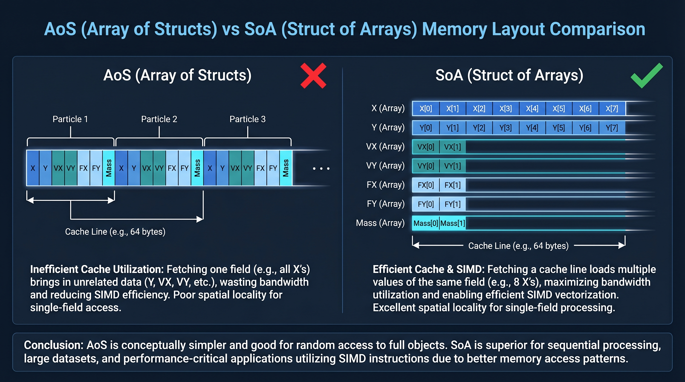

Cache miss: **~100+ cycles** vs cache hit: **~1 cycle** — SoA gives **8x better cache utilization**.

---

# Pointer Lowering as the Key Enabler

**Why can't production compilers (GCC, LLVM, MSVC) do AoS→SoA?**

The **aliasing barrier**: pointers can alias any memory location.

```c
void update(Particle* p, Particle* particles, int n) {
    // Does p point into particles[]?
    // The compiler can't know → can't rearrange memory layout
}
```

**GoAny's pointer lowering** eliminates pointers before the memory layout pass:
- `*T` → `int` index into `_pool_T`
- No aliasing possible — indices are just integers
- The compiler has **full knowledge** of data layout

This is why GoAny can do what LLVM cannot.

---

# Performance Results: C++ Particle Simulation

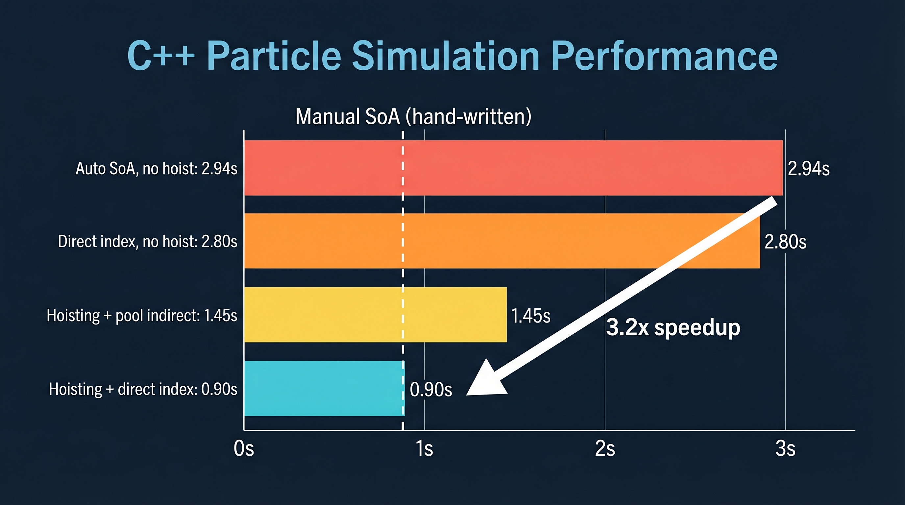

The compiler generates code **as fast as what an expert would write by hand**.

---

# Additional SoA Optimizations

**Nested loop hoisting**: outer-loop-invariant SoA reads lifted out

```go
// Before:                              // After:
for i := 0; i < N; i++ {               for i := 0; i < N; i++ {
  for j := 0; j < N; j++ {               _hoist_X := pool.X[i]
    dx := pool.X[j] - pool.X[i]          _acc_FX := 0.0
    // pool.X[i] read N times!            for j := 0; j < N; j++ {
  }                                         dx := pool.X[j] - _hoist_X
}                                           _acc_FX += ...
                                          }
                                          pool.FX[i] += _acc_FX
                                        }
```

**Pool index slice elimination**: removes `[]int` indirection layer

`particles[i]` → `i` (pool indices are always sequential)

---

<!-- Section 12 cont: Research Directions -->

# The Macro vs Micro Optimization Gap

> **Cache misses cost 100+ cycles. An instruction costs 1.**

Production compilers perfect the **micro** level (single-digit % gains):
- Register allocation, instruction scheduling, peephole optimization

Meanwhile, they **ignore the macro level** (2x-10x gains):
- Memory layout (AoS vs SoA)
- Data movement (CPU ↔ GPU, RAM ↔ cache)
- Access patterns (sequential vs random)

**That's where the 2x-10x wins live. And it's uncontested territory.**

---

# Pointer Lowering Opens New Doors

Once pointers are eliminated, entirely new optimizations become possible:

| Optimization | Description |
|---|---|
| **AoS → SoA** | Automatic data layout transformation (done!) |
| **Parallelization** | No aliasing → safe automatic parallelism |
| **GPU extraction** | Sequential pool access → GPU kernel candidate |
| **Dead field elimination** | Remove struct fields never read |
| **Data compression** | Pack sparse fields into denser layouts |
| **Prefetch insertion** | Predictable access patterns → HW prefetch |

This is **essentially uncontested territory** in compiler research.

---

# Demo

<!-- Live demo placeholder -->

---

<!-- _class: title -->

# Thank You!

### Questions?

**github.com/nicholasgasior/goany**

